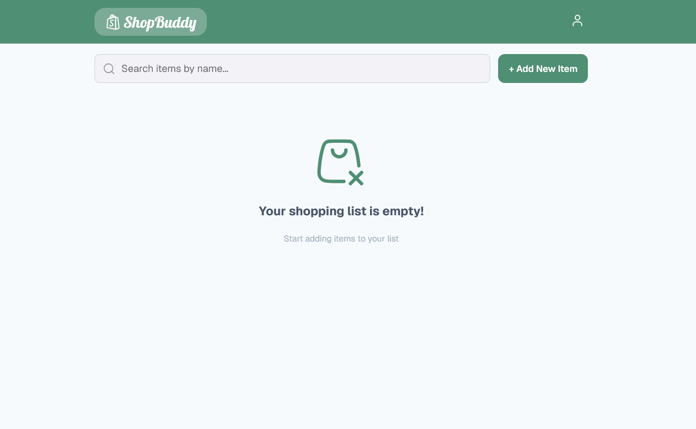

# ShopBuddy - Shopping list app

ShopBuddy is a lightweight shopping-list web application built with React and TypeScript. It lets users create a local profile, manage shopping items, search and sort their list, and update their profile details from a simple responsive interface. The application currently runs entirely in the browser. User details and shopping-list items are stored in `localStorage`.

# Preview



## Features

- Create an account with a name, surname, email address, cell number, and password.
- Sign in and remain signed in after refreshing the page.
- Add shopping items with:
	- Item name
	- Category
	- Quantity
	- Notes
	- Optional image URL
- Edit or delete existing items.
- Mark an item as completed in the current session with checkbox feedback.
- Search items by name.
- Sort items by name, category, or date added.
- View and update profile details.
- Sign out and clear the saved user session.
- Receive toast notifications for saves, deletes, sorting, and other actions.

## Tech Stack

- [React](https://react.dev/) 19
- [TypeScript](https://www.typescriptlang.org/)
- [Vite](https://vite.dev/)
- [React Router](https://reactrouter.com/)
- [Redux Toolkit](https://redux-toolkit.js.org/) and React Redux
- [react-hot-toast](https://react-hot-toast.com/) for notifications
- [Hugeicons](https://hugeicons.com/) for interface icons
- `crypto-js` for the current client-side password transformation
- `oxlint` for linting

## Requirements

- Node.js 18 or newer
- npm 9 or newer

Check your installed versions with:

```bash
node --version
npm --version
```

## Getting Started

### 1. Install dependencies

From the project root, run:

```bash
npm install
```

### 2. Start the development server

```bash
npm run dev
```

Vite will print the local URL in the terminal, normally `http://localhost:5173`.

### 3. Create a local account

Open the development URL, select **Create an account**, and complete the registration form. After registration, the app redirects to `/home`.

## Available Scripts

| Command | Description |
| --- | --- |
| `npm run dev` | Starts the Vite development server with hot reload. |
| `npm run build` | Runs the TypeScript build and creates a production bundle in `dist/`. |
| `npm run lint` | Runs Oxlint against the project. |
| `npm run preview` | Serves the production build locally for verification. |

Typical verification commands are:

```bash
npm run lint
npm run build
npm run preview
```

## Application Routes

| Route | Access | Purpose |
| --- | --- | --- |
| `/` | Redirect | Sends authenticated users to `/home` and other users to `/login`. |
| `/login` | Public | Signs in an existing locally stored user. |
| `/register` | Public | Creates a local user profile. |
| `/home` | Authenticated | Displays and manages the shopping list. |
| `/profile` | Authenticated | Updates profile information or signs out. |

Unauthenticated users are redirected to `/login`. Authenticated users are redirected to `/home` when they try to open `/login` or `/register`.

## How Data Is Stored

The Redux store has two slices:

- `auth`: stores the current user and authentication status.
- `shoppingList`: stores the shopping items.

The following browser storage keys are used:

| Key | Contents |
| --- | --- |
| `user` | The locally registered user profile and transformed password value. |
| `shopping_list_items` | The JSON-serialized shopping-item array. |

Shopping items have this shape:

```ts
interface ShoppingItem {
	id: string;
	name: string;
	category?: string;
	quantity?: string;
	notes?: string;
	imageUrl?: string;
	dateAdded: string;
}
```

Search and sort controls are represented in the URL query string. For example:

```text
/home?search=milk&sort=category
```

This makes the current list view easy to refresh or share within the same browser context.

## Project Structure

```text
.
├── public/                  # Static public assets
├── src/
│   ├── assets/              # Imported application assets
│   ├── components/          # Header, search, modal, and route components
│   ├── pages/               # Login, registration, home, and profile screens
│   ├── redux/               # Redux store and state slices
│   ├── services/            # Reserved location for API integrations
│   ├── types/               # Shared type definitions
│   ├── App.tsx              # Router and global toast provider
│   ├── App.css              # App-level styles
│   ├── index.css            # Global and page styles
│   └── main.tsx             # React entry point and Redux provider
├── index.html
├── package.json
├── tsconfig.json
└── vite.config.ts
```

## Development Notes

- The app uses `React.StrictMode` and Redux's `<Provider>` from `src/main.tsx`.
- Route access is controlled from `App.tsx` using the Redux authentication state.
- New items are inserted at the beginning of the list and receive an ISO timestamp.
- Empty-state content changes when a search returns no matching items.
- The current completion checkbox only displays success feedback; completion state is not persisted on the item model.
- The `src/services/api.ts` file is reserved for a future server-backed implementation and is currently empty.

## Data and Security Limitations

This project is intended as a front-end/local-storage demonstration, not as a production authentication system.

- Account data is stored in the browser and is not synchronized across devices or browsers.
- Clearing site data removes the local account and shopping list.
- The password is transformed with a hard-coded client-side AES key. This should not be treated as secure password storage because the key and application code are delivered to the browser.
- There is no server-side authentication, authorization, validation, or multi-user data isolation.
- Image URLs are loaded directly by the browser and should only be supplied from trusted sources.

For production use, replace local authentication with a server-side identity provider or API, store passwords only as server-side password hashes, validate all input on the server, and associate lists with authenticated user records.

## Production Build

Create an optimized build with:

```bash
npm run build
```

The generated files are placed in `dist/`. They can be served by any static hosting provider that supports SPA fallback routing. Configure the host to serve `index.html` for client-side routes such as `/home` and `/profile`.

To inspect the production build locally:

```bash
npm run preview
```

## Contributing

1. Create a feature branch.
2. Make a focused change that follows the existing TypeScript and React patterns.
3. Run `npm run lint` and `npm run build` before opening a pull request.
4. Include a short description of user-facing behavior and any storage or routing changes.


